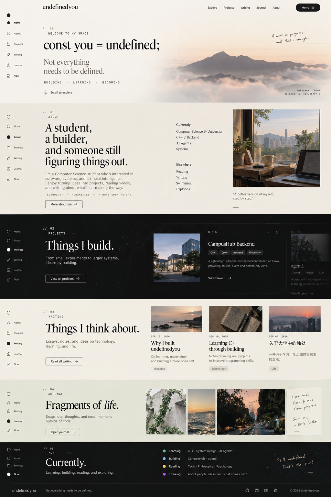
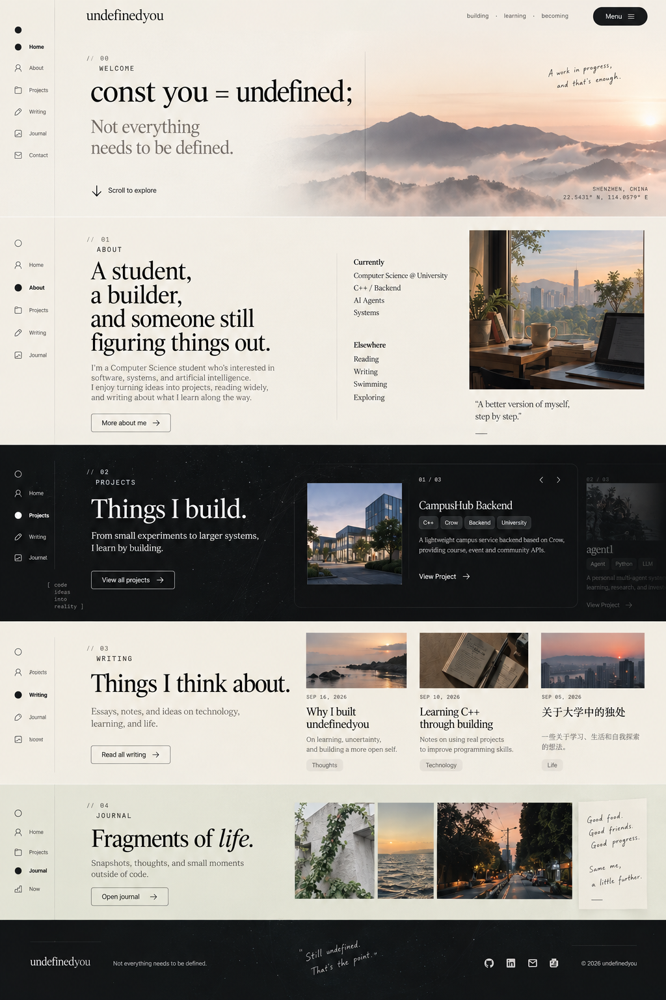

# undefinedyou.com — Project Memory & Design Baseline

> Status: **Current agreed target**
>
> Purpose: This file is the single memory/reference document for the `undefinedyou.com` personal website. It summarizes the design decisions already agreed upon so future implementation work does not drift away from the intended direction.

---

## 1. Project Identity

**Project name:** `undefinedyou`  
**Domain:** `undefinedyou.com`

The website is not intended to be only a developer portfolio.

It should become a long-term personal digital space combining:

- software projects
- technical exploration
- long-form writing
- personal essays
- life notes
- photography
- reading
- reflections
- personal growth

The overall design concept is:

> **Technology × Humanities × Editorial × Personal**

The site should feel technical but not cyberpunk, modern but not SaaS-like, editorial but not overly minimal, personal but not messy, and suitable for continuous iteration over many years.

---

## 2. Brand Idea

The brand is:

```text
undefinedyou
```

The name comes from the programming concept:

```js
const you = undefined;
```

But the meaning goes beyond code:

> A person is not predefined.

The brand may explore ideas such as uncertainty, learning, building, becoming, exploration, growth, and identity.

Temporary placeholder copy:

```text
const you = undefined;
```

```text
Not everything needs to be defined.
```

```text
building.
learning.
becoming.
```

These are not final copy. Final wording will be rewritten later.

---

## 3. Main Design References

### Alvalens — Interaction / Structure

The existing downloaded Alvalens template is the structural base.

The parts we explicitly liked and want to preserve conceptually:

- full-screen or near-full-screen homepage sections
- clear one-section-at-a-time navigation
- left-side fixed icon navigation
- top-right menu
- comfortable project browsing
- strong whitespace
- smooth transitions
- clear page/section boundaries

The goal is to **evolve the selected Alvalens template**, not replace it with an unrelated website.

### Dante — Typography / Humanistic Visual Language

Dante is the main visual reference for the humanistic side.

The elements we liked:

- warm cream / off-white background
- elegant serif typography
- restrained colors
- strong editorial feeling
- magazine-like composition
- comfortable long-form reading
- large whitespace
- literary/human atmosphere

Dante is not used as the codebase. It provides the visual DNA for lighter/editorial parts of the site.

---

## 4. Current Visual Goal

The final website should combine:

```text
Alvalens interaction structure
+
Dante editorial warmth
+
undefinedyou original identity
```

It must not look like:

```text
Alvalens + changed text
```

It should gradually become its own visual system.

---

## 5. Homepage Structure

The agreed homepage order is:

```text
00 Hero
01 About
02 Projects
03 Writing
04 Journal
05 Contact / Footer
```

There is no `Now` section.

The last Sidebar item is:

```text
Contact
```

---

## 6. Homepage Experience

The homepage should feel like a guided journey through different sides of one person.

```text
Hero
→ identity / atmosphere

About
→ who I am

Projects
→ what I build

Writing
→ what I think

Journal
→ how I live

Contact
→ how to reach me
```

Each section should be distinct, but all sections must still belong to the same world.

---

## 7. Scroll Behavior

The user liked Alvalens' full-screen navigation and smooth motion, but did not like continuous drifting where it becomes unclear whether a section has fully changed.

The target behavior is:

> **Soft Snap / Controlled Scroll**

Expected feeling:

```text
scroll input
↓
smooth transition
↓
clear landing
↓
short stable reading state
↓
next scroll
```

Target transition duration:

```text
approximately 0.6–0.9 seconds
```

Requirements:

- smooth
- deliberate
- clear stop points
- clear current section
- no endless drifting
- no overlapping chaotic movement
- no confusing half-section state
- premium but readable

---

## 8. Left Sidebar

The left-side navigation is one of the most important approved elements from Alvalens and should be preserved.

Order:

```text
Home
About
Projects
Writing
Journal
Contact
```

Desired behavior:

- fixed on desktop
- minimal
- icon-based
- labels can appear on hover
- current section clearly highlighted
- clicking smoothly moves to the matching section
- active state stays synchronized with scroll position

Possible state:

```text
○ inactive
● active
```

The Sidebar should be integrated into the new editorial design instead of retaining the original dark-gray Alvalens appearance.

---

## 9. Top-Right Menu

The top-right menu concept is also approved.

Requirements:

- visible `Menu` control
- large/full-screen overlay
- Home
- About
- Projects
- Writing
- Journal
- Contact

Visual direction:

- editorial
- large typography
- strong whitespace
- simple transition
- not visually noisy

---

## 10. Hero Section

The Hero should not begin like a standard developer résumé.

Avoid:

```text
Hi, I'm ...
I'm a Software Engineer
```

Instead, it should establish atmosphere first.

Current structural idea:

```text
undefinedyou                                      Menu


                       00


            const you = undefined;

            Not everything
            needs to be defined.

            building · learning · becoming


                     ↓ explore
```

The exact text is temporary.

### Hero visual language

- warm cream / off-white background
- large whitespace
- strong serif typography
- subtle mono/system details
- section number
- fine lines
- subtle technical grid
- restrained animation

Avoid particles, WebGL spectacle, giant glows, neon RGB, 3D hero scenes, and constantly moving backgrounds.

Desired feeling:

> calm, thoughtful, modern, intentional

---

## 11. About Section

The About section should look like an editorial spread, not a résumé table.

Avoid:

```text
Name:
School:
Major:
Skills:
```

Preferred composition:

```text
01 / ABOUT

A student,
a builder,
and someone still
figuring things out.

                         CURRENTLY

                         Computer Science
                         C++
                         Backend Systems
                         AI Agents

                         ALONGSIDE

                         Writing
                         Reading
                         Life
                         Exploring
```

The text is temporary.

The goal is to communicate the person's current direction, interests, and evolving identity.

---

## 12. Projects Section

Projects should transition the site into a darker, more technical world.

Possible transition:

```text
Warm Cream
↓
Charcoal / Near Black
```

Visual language:

- dark charcoal
- off-white text
- monospace metadata
- fine grid
- thin lines
- code/system details
- large project visuals
- architecture/technical references

The user specifically liked the comfortable project browsing behavior in Alvalens.

Therefore:

- preserve the interaction concept
- do not replace it with a generic 3-column card grid
- projects should feel curated
- each project should have a clear resting state

Temporary heading:

```text
Things I build.
```

---

## 13. Project Detail Pages

Project pages may be more technical than the homepage.

Possible structure:

```text
Overview
Problem
Architecture
Technology
Implementation
Screenshots
Challenges
What I Learned
Future Work
GitHub
```

Visual world:

```text
Dark
Mono
Grid
Code
Architecture
Structured
```

---

## 14. Writing Section

After Projects, the visual world should return to warm/light editorial tones.

Temporary heading:

```text
Things I think about.
```

Writing includes:

- essays
- technical thinking
- learning
- personal reflections
- ideas
- life
- long-form articles

The homepage Writing area should feel like:

> **an editorial magazine preview**

not a generic blog card grid.

---

## 15. Writing Pages

Writing should use the strongest Dante-like editorial language.

Visual direction:

- warm cream
- serif
- strong typography
- large whitespace
- magazine-like layout
- excellent reading experience
- minimal animation while reading

Writing content should eventually support MDX and technical content where needed:

- headings
- images
- blockquotes
- code
- lists
- links
- syntax highlighting
- diagrams
- potentially LaTeX later

---

## 16. Journal Section

Journal is intentionally different from Writing.

### Writing

```text
formal
complete
essay-like
long-form
```

### Journal

```text
life
photos
short reflections
places
reading
moments
fragments
```

Temporary heading:

```text
Fragments of life.
```

Journal visual language:

- warm
- photographic
- quieter
- intimate
- date-oriented
- personal archive feeling

Possible elements:

- photos
- dates
- short notes
- timeline
- reading fragments
- travel/life memories

Journal should feel closer to:

> **Personal Archive / Digital Garden**

than to a second blog.

---

## 17. Contact

The last homepage section is Contact.

It should remain quiet and minimal.

Possible structure:

```text
05 / CONTACT

Let's connect.

Email
GitHub
LinkedIn
```

No fake personal information should be added.

Missing information should remain hidden or empty until real values are supplied.

---

## 18. Typography System

The site uses three typography roles.

### Serif

For:

- Hero statements
- About editorial statement
- Writing titles
- Journal emphasis

Represents:

```text
Humanity
Editorial
Literature
Reflection
```

### Sans

For:

- UI
- navigation
- normal body text
- buttons

Represents:

```text
Modern
Neutral
Readable
```

### Mono

For:

- code
- section numbers
- project metadata
- system labels
- technical information

Represents:

```text
Technology
Developer
System
Structure
```

The contrast between **Serif and Mono** is an important part of the site's identity.

---

## 19. Color System

### Light world

```text
Warm White
Cream
Off-white
Black
Muted Gray
```

### Dark world

```text
Charcoal
Near Black
Soft Gray
Off-white
```

### Accent

Use one restrained accent color only.

The exact accent is not finalized yet.

Possible future directions:

```text
Muted Red
Deep Blue
Forest Green
Burnt Orange
```

Avoid rainbow palettes, bright blue-purple gradients, heavy neon, and many simultaneous accent colors.

---

## 20. Motion Rules

Motion must support:

```text
Hierarchy
Navigation
Atmosphere
Understanding
```

Recommended:

- fade
- slide
- text reveal
- mask reveal
- subtle parallax
- calm hover motion
- page transitions
- background transitions
- section transitions

Use sparingly:

- 3D
- particles
- physics
- custom cursors
- glow
- continuous movement

Motion character:

```text
Smooth
Calm
Intentional
Readable
```

---

## 21. Different Worlds, One Identity

Different sections/pages are allowed to have different visual moods.

### Projects

```text
Technical
Dark
Mono
Grid
Code
Architecture
```

### Writing

```text
Editorial
Cream
Serif
Essay
Magazine
```

### Journal

```text
Warm
Photography
Personal
Timeline
Fragments
```

They remain coherent through shared:

- `undefinedyou` branding
- typography roles
- spacing system
- navigation
- thin-line visual language
- transition timing
- color tokens
- interaction quality

The goal is:

> **one identity with multiple rooms**

not three unrelated websites stitched together.

---

## 22. Responsive Direction

Desktop is the primary visual target.

The final site must also work on:

- tablet
- mobile

The left Sidebar does not need to remain unchanged on mobile.

Possible mobile alternatives:

- bottom navigation
- compact rail
- menu-only navigation

Do not create scroll traps on mobile.

---

## 23. Content Architecture

The site should remain easy to update over many years.

Adding a:

```text
Project
Writing Article
Journal Entry
```

should not require major page code edits.

Preferred idea:

```text
content/
├── projects/
├── writing/
└── journal/
```

or another clean centralized data/content system.

Principle:

> **Content and presentation should be separated.**

---

## 24. Current Implementation Base

Current workspace:

```text
/Users/francis/Documents/Project/undefinedyou
```

The project is based on the downloaded Alvalens template.

Future development must continue from this existing workspace.

Do not create a separate replacement project unless explicitly decided later.

---

## 25. Current Functional Target

The homepage must eventually support all six sections correctly:

```text
Home
↓
About
↓
Projects
↓
Writing
↓
Journal
↓
Contact
```

All six must be reachable through normal scrolling and Sidebar navigation.

Current implementation issues are bugs, not changes to the design goal.

---

## 26. Approved Visual Reference Images

Two concept images were generated during the design discussion.

The **second image is the stronger/current reference baseline**, because it reflects the updated navigation concept with Contact instead of Now and is closer to the agreed direction.

### Early concept



### Current approved visual direction



The images are references for:

- overall atmosphere
- warm editorial palette
- dark Projects contrast
- vertical multi-section journey
- large typography
- balance of technical and humanistic elements
- visual quietness
- section hierarchy

They are not pixel-perfect specifications.

The final implementation may refine proportions, typography, imagery, and interactions as long as it preserves the same design direction.

---

## 27. Final Design Summary

The target website can be summarized as:

```text
Alvalens
→ interaction structure

Dante
→ typography + warmth + editorial feeling

undefinedyou
→ brand + identity + content worlds
```

The final site should feel:

> **technical, human, editorial, calm, curious, and intentionally unfinished.**

This document should be treated as the current design memory / source of truth until explicitly revised.
